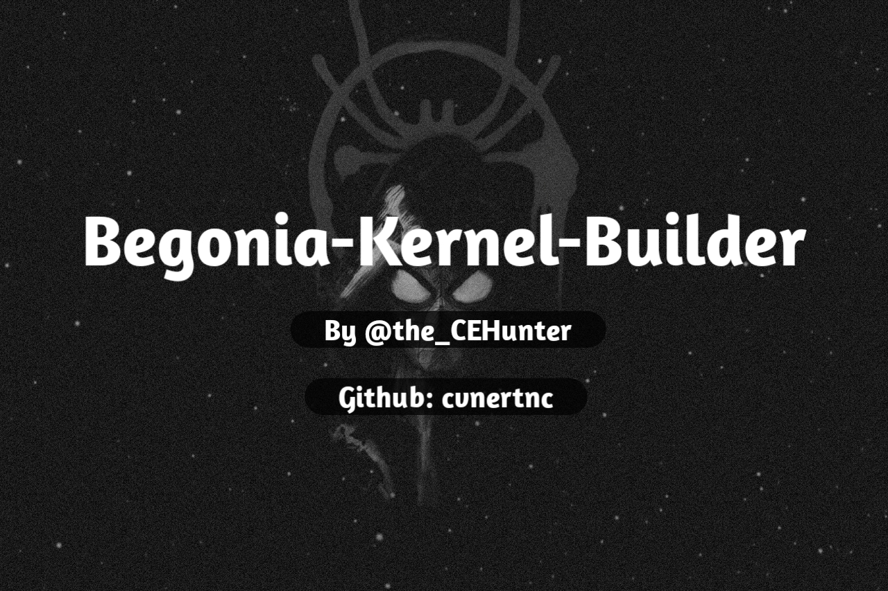

#### ⚠️ [Original Repo](https://github.com/PhamtomK12/Android-Kernel-Builder)
# Begonia-Kernel-Builder

> Automatically follow daily KernelSU, SukiSU-Ultra and KernelSU-Next updates and build the android kernel for Xiaomi Redmi Note 8 Pro(begonia)

These builds are created for the Xiaomi Redmi Note 8 Pro(begonia) device. It is built with KernelSU, SukiSU-Ultra and KernelSU-Next and [SUSFS](https://gitlab.com/simonpunk/susfs4ksu)

If you are using a kernel with magisk installed, uninstall magisk before installing the Your kernel. After removing magisk, you can install the Your kernel.

Get the [latest Build release](https://github.com/cvnertnc/Begonia-Kernel-Builder/releases/latest)

Astera Kernel By [MrErenK](https://github.com/MrErenK)

Power Kernel By [Saikrishna1504](https://github.com/Saikrishna1504/kernel_xiaomi_mt6785)

Nova Kernel By [Wahid7852](https://github.com/Wahid7852)

Download and install KernelSU-Next Manager
> [Stable Version](https://github.com/KernelSU-Next/KernelSU-Next/releases/latest) || [Nightly Version](https://nightly.link/KernelSU-Next/KernelSU-Next/workflows/build-manager/next/manager)

If you are using KernelSU, download and install the manager
> [Stable Version](https://github.com/rsuntk/kernelsu/releases/latest) || [Nightly Version](https://nightly.link/rsuntk/KernelSU/workflows/build-manager/main)

If you are using SukiSU-Ultra, download and install the manager
> [Stable Version](https://github.com/SukiSU-Ultra/SukiSU-Ultra/releases/latest) || [Nightly Version](https://nightly.link/SukiSU-Ultra/SukiSU-Ultra/workflows/build-manager/main)

Download and install SUSFS Module
> [Stable Version](https://github.com/sidex15/susfs4ksu-module/releases/latest) || [Nightly Version](https://nightly.link/sidex15/susfs4ksu-module/workflows/build/v1.5.2+)

Download and install [Mountify Module](https://github.com/backslashxx/mountify/releases/latest)

Also see here [`CONFIG.md`](./CONFIG.md).

## Supported Begonia Kernels      
| Kernels | Build | [KernelSU-Next](https://github.com/KernelSU-Next/KernelSU-Next) | [KernelSU](https://github.com/rsuntk/kernelsu) | [SukiSU-Ultra](https://github.com/SukiSU-Ultra/SukiSU-Ultra) | [SUSFS](https://gitlab.com/simonpunk/susfs4ksu) | [KPM](https://github.com/SukiSU-Ultra/SukiSU_KernelPatch_patch) | [APatch](https://github.com/SukiSU-Ultra/APatch) |      
|---------|-------|--------------|----------|------------------------|-------|-------|--------|    
| [Astera](https://github.com/xiaomi-begonia-dev/android_kernel_xiaomi_mt6785) | ✅ | ✅ | ✅ | ✅ | ✅ | ❌ | ❌ |    
| [Power](https://github.com/Saikrishna1504/kernel_xiaomi_mt6785) | ✅ | ✅ | ✅ | ✅ | ✅ | ✅ | ✅ |    
| [Nova](https://github.com/Nova-Kernels/kernel_xiaomi_mt6785) | ✅ | ✅ | ✅ | ✅ | ✅ | ✅ | ✅ |

## Thanks
  
> Many Thanks [Sidex15](https://github.com/sidex15) for all the [Bug Fixes](https://github.com/cvnertnc/Begonia-Kernel-Builder/commit/a6aad58fa292b0fab54199ab4f982c286b35cb6d)

[MrErenK](https://github.com/MrErenK)  
[rifsxd](https://github.com/rifsxd)  
[ShirkNeko](https://github.com/ShirkNeko)  
[rsuntk](https://github.com/rsuntk)  
[Saikrishna1504](https://github.com/Saikrishna1504)  
[Wahid7852](https://github.com/Wahid7852)  
[PhamtomK12](https://github.com/PhamtomK12)  
[AndroidHQ254](https://github.com/AndroidHQ254)  
[AKR Android Developer Community](https://www.akr-developers.com/)  
[DogDayAndroid/KSU_Thyme_BuildBot](https://github.com/DogDayAndroid/KSU_Thyme_BuildBot)  
[xiaoleGun/KernelSU_Action](https://github.com/xiaoleGun/KernelSU_Action)  
[UtsavBalar1231/Drone-scripts](https://github.com/UtsavBalar1231/Drone-scripts)  
